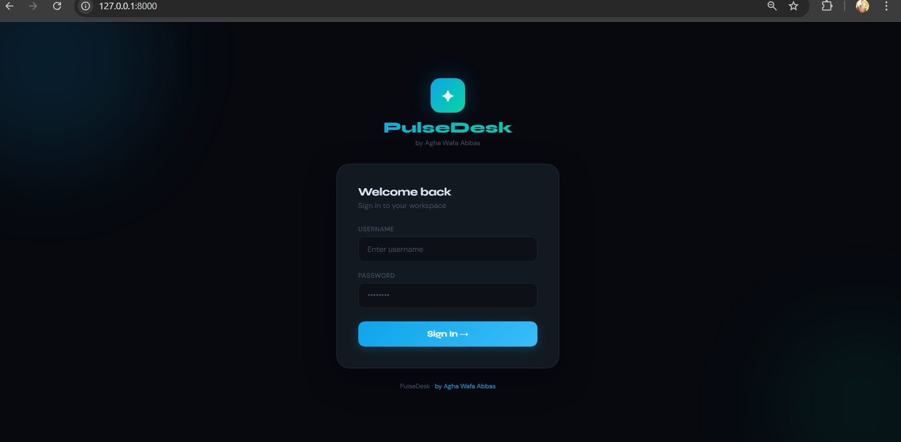
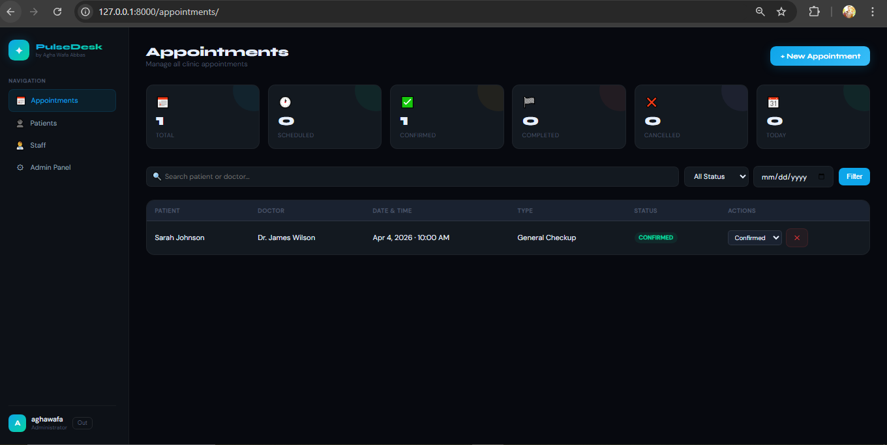
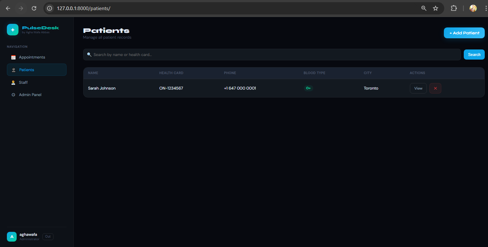
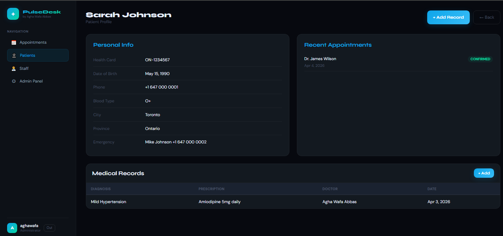
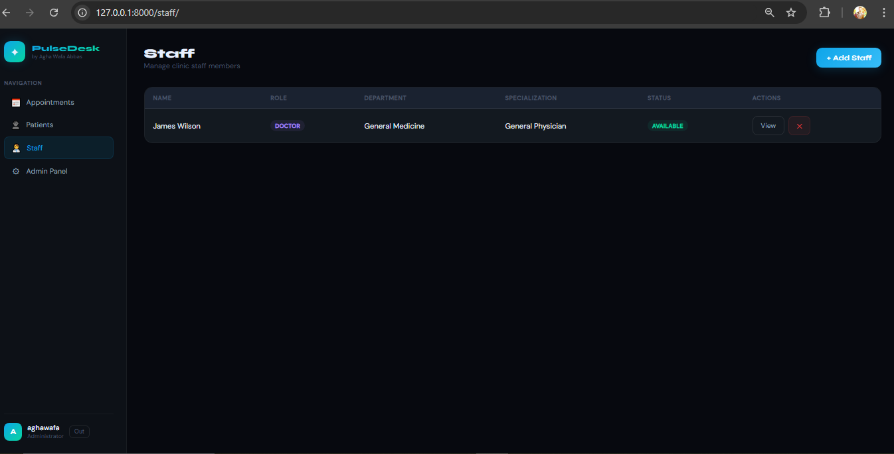
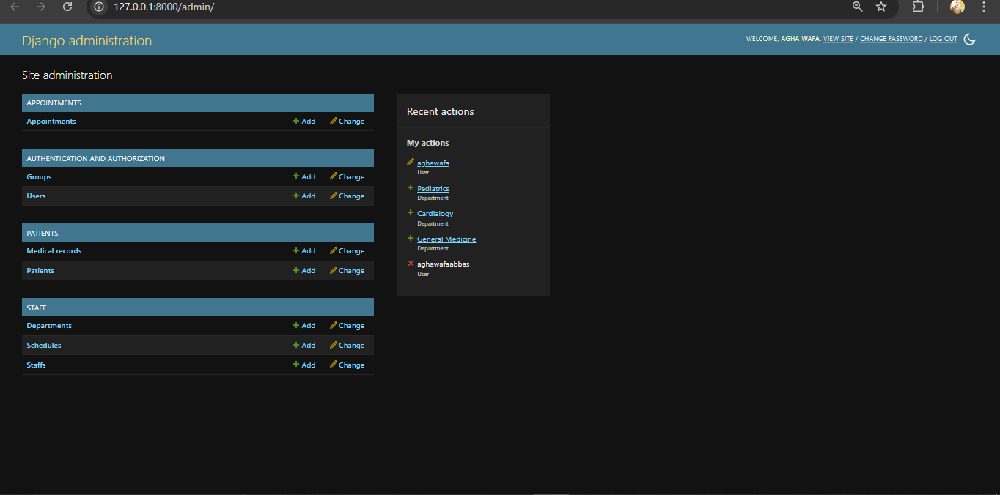

# ✦ PulseDesk
### Clinical Management System — Django


> A production-grade, multi-app Django clinical management system — demonstrating real-world Full Stack Development patterns including role-based workflows, multi-app architecture, relational data modelling, and a professional responsive UI.

---

## 🚀 Live Demo

👉 **Coming Soon — Deployment in progress**

---

## 📸 Screenshots

### Login Page


### Appointments Dashboard


### Patients List


### Patient Detail


### Staff Management


### Admin Panel


---

## 👨‍💻 Developer

**Agha Wafa Abbas**
**Full Stack Developer | Lecturer, School of Computing**

| Institution | Location | Email |
|------------|----------|-------|
| University of Portsmouth | Winston Churchill Ave, Southsea, Portsmouth PO1 2UP, UK | agha.wafa@port.ac.uk |
| Arden University | Coventry, United Kingdom | awabbas@arden.ac.uk |
| Pearson | London, United Kingdom | — |
| IVY College of Management Sciences | Lahore, Pakistan | wafa.abbas.lhr@rootsivy.edu.pk |

---

## 🏭 Real-World Use Cases

- **Private Clinics** — Patient registration, appointment scheduling, medical records
- **Family Health Teams** — Ontario/Canada multi-doctor practices
- **Walk-in Clinics** — High-volume appointment management
- **Physiotherapy Centers** — Session tracking and patient history
- **Dental Offices** — Appointment lifecycle management
- **Mental Health Clinics** — Confidential record keeping
- **Healthcare Startups** — MVP clinical management product
- **University Teaching** — Real-world Django multi-app architecture reference

---

## 👥 User Roles

| Role | Access | Workflow |
|------|--------|----------|
| **System Admin** | Full access | Manages departments, staff accounts |
| **Receptionist** | Frontend dashboard | Registers patients, books appointments |
| **Doctor** | Frontend dashboard | Views appointments, adds medical records |
| **Patient** | Physical visit only | Registered by receptionist |

---

## ✨ Features

- 🔐 Controlled registration — admin/receptionist only
- 👤 Full patient profiles — health card, blood type, emergency contact
- 📁 Medical records — diagnosis, prescription, clinical notes
- 📅 Appointment booking — patient + doctor + date + time
- 🔄 5-stage lifecycle — Scheduled → Confirmed → Completed → Cancelled → No Show
- 🔍 Search and filter — by status, date, doctor, patient
- 📊 Real-time stats dashboard
- 👨‍⚕️ Staff management — roles, departments, specializations
- ⚙️ Django Admin — fully configured
- 📱 Fully responsive dark UI

---

## 🛠️ Technology Stack

| Layer | Technology |
|-------|-----------|
| Backend | Python 3.10+ / Django 6.x |
| Database | SQLite (dev) / PostgreSQL (prod) |
| Frontend | HTML5, CSS3, Vanilla JavaScript |
| Fonts | Google Fonts — Syne + DM Sans |
| Auth | Django contrib.auth |
| Admin | Django Admin (customized) |
| Version Control | Git + GitHub |
| Deployment | Coming soon |

---

## 🗄️ Figure 1 — Entity Relationship Diagram (ERD)

```
┌──────────────┐     ┌──────────────────┐     ┌──────────────────┐
│     USER     │     │   DEPARTMENT     │     │    SCHEDULE      │
│──────────────│     │──────────────────│     │──────────────────│
│ id (PK)      │     │ id (PK)          │     │ id (PK)          │
│ username     │     │ name             │     │ staff_id (FK)    │
│ first_name   │     │ description      │     │ day_of_week      │
│ last_name    │     └────────┬─────────┘     │ start_time       │
│ email        │              │ 1             │ end_time         │
│ password     │              │ N             │ is_available     │
└──────┬───────┘     ┌────────▼─────────┐     └──────────────────┘
       │             │      STAFF       │
       │  1          │──────────────────│
       │             │ id (PK)          │
       │             │ user_id (FK)     │
       │             │ role             │
       │             │ department (FK)  │
       │             │ specialization   │
       │             │ license_number   │
       │             │ is_available     │
       │             └────────┬─────────┘
       │                      │ 1 (doctor)
       │ 1                    │ N
       │             ┌────────▼─────────┐
       ├─────────────│   APPOINTMENT    │
       │ N           │──────────────────│
       │             │ id (PK)          │
       │             │ patient_id (FK)  │
       │             │ doctor_id (FK)   │
       │             │ date + time      │
       │             │ type + status    │
       │             │ reason + notes   │
       │             └──────────────────┘
       │ 1
       │             ┌──────────────────┐    ┌──────────────────┐
       └─────────────│    PATIENT       │    │  MEDICALRECORD   │
                  N  │──────────────────│    │──────────────────│
                     │ id (PK)          │◄1──│ id (PK)          │
                     │ user_id (FK)     │ N  │ patient_id (FK)  │
                     │ health_card      │    │ diagnosis        │
                     │ date_of_birth    │    │ prescription     │
                     │ blood_type       │    │ notes            │
                     │ phone            │    │ created_by (FK)  │
                     │ emergency_contact│    │ created_at       │
                     └──────────────────┘    └──────────────────┘
```

---

## 🔄 Figure 2 — Request Sequence Diagram

```
Browser        URL Router     Middleware      View           Database
   │               │              │             │               │
   │─POST /login───►              │             │               │
   │               │─match───────►│─auth────────►               │
   │◄──redirect /appointments/────────────────────              │
   │                                            │               │
   │─GET /appointments/─────────────────────────►               │
   │                                            │─Appt.filter()─►
   │                                            │◄──queryset────│
   │◄──200 HTML─────────────────────────────────│               │
   │                                            │               │
   │─POST /appointments/add/────────────────────►               │
   │                                            │─Appt.create()─►
   │◄──302 redirect─────────────────────────────│               │
```

---

## 🏗️ Figure 3 — System Architecture

```
┌──────────────────────────────────────────────────┐
│                  PRODUCTION                       │
│                                                   │
│  Browser ──► Cloud Server ──► Django ──► SQLite   │
│              (WSGI)          patients             │
│                              appointments         │
│                              staff                │
└──────────────────────────────────────────────────┘

┌──────────────────────────────────────────────────┐
│                  DEVELOPMENT                      │
│  Browser ──► runserver (8000) ──► SQLite          │
└──────────────────────────────────────────────────┘
```

---

## 📊 Figure 4 — Appointment State Machine

```
┌────────────┐  Confirm  ┌─────────────┐  Complete  ┌───────────┐
│ SCHEDULED  │──────────►│  CONFIRMED  │───────────►│ COMPLETED │
└─────┬──────┘           └─────────────┘            └───────────┘
      │ Cancel                               No Show
      ▼                                         ▼
┌────────────┐                          ┌──────────────┐
│ CANCELLED  │                          │   NO SHOW    │
└────────────┘                          └──────────────┘

Types: General Checkup · Follow Up · Emergency · Specialist · Lab Test
```

---

## ⚡ Figure 5 — URL & API Flow

```
GET  /                      ──► LoginView
GET  /appointments/         ──► appointment_list() → stats + filter
POST /appointments/add/     ──► add_appointment()  → Appointment.create()
POST /appointments/<id>/status/ ──► update_status() → appt.save()
GET  /patients/             ──► patient_list()
GET  /patients/<id>/        ──► patient_detail() → records + appointments
POST /patients/add/         ──► add_patient() → User + Patient create
POST /patients/<id>/record/ ──► add_medical_record() → MedicalRecord.create()
GET  /staff/                ──► staff_list()
POST /staff/add/            ──► add_staff() → User + Staff create
GET  /admin/                ──► Django Admin (superuser only)
```

---

## 📦 Quick Setup

```bash
git clone https://github.com/Aghawafaabbass/Pulsedesk.git
cd Pulsedesk
python -m venv venv
venv\Scripts\activate
pip install -r requirements.txt
python manage.py migrate
python manage.py createsuperuser
python manage.py runserver
```

Open: `http://127.0.0.1:8000/`

---

## 📁 Project Structure

```
Pulsedesk/
├── manage.py
├── requirements.txt
├── README.md
├── screenshots/
│   ├── 01_login.png
│   ├── 02_appointments.png
│   ├── 03_patients.png
│   ├── 04_patient_detail.png
│   ├── 05_staff.png
│   └── 06_admin.png
├── docs/
│   └── PulseDesk_Complete_Guide.docx
├── pulsedesk/
│   ├── settings.py
│   ├── urls.py
│   └── wsgi.py
├── patients/
├── appointments/
├── staff/
└── templates/
```

---

## 🔮 Future Enhancements

- [ ] Role-based permissions
- [ ] Patient login portal
- [ ] Email notifications
- [ ] Invoice & billing system
- [ ] REST API with Django REST Framework
- [ ] PostgreSQL for production
- [ ] Docker containerization
- [ ] Cloud deployment

---

## 📄 License

MIT License

---

<div align="center">
<strong>PulseDesk</strong> — Built with Django<br/>
<em>Full Stack Developer · Agha Wafa Abbas</em><br/>
<a href="https://github.com/Aghawafaabbass">GitHub</a>
</div>
